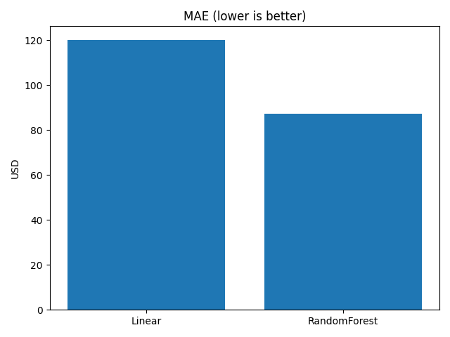
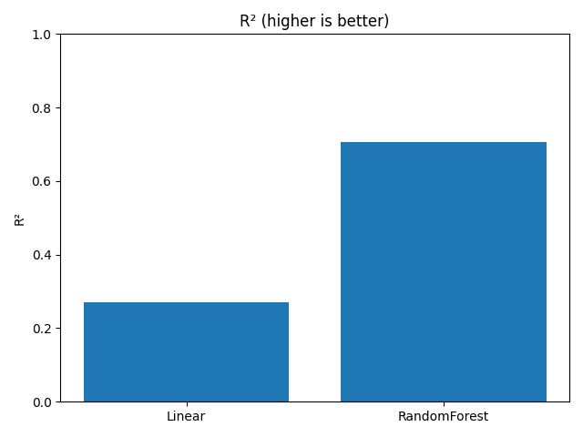
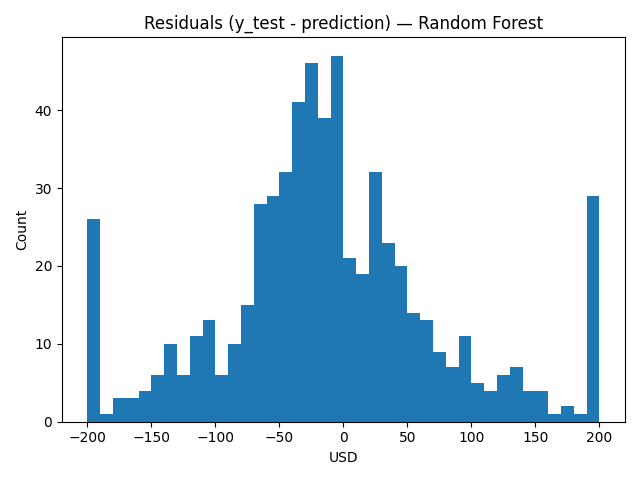
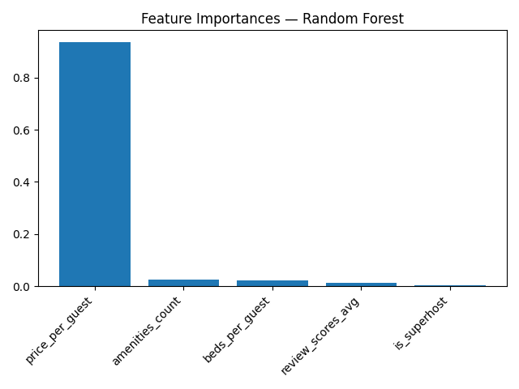

# Airbnb Austin — Pricing & Occupancy Insights

**Goal:** Predict nightly Airbnb prices in Austin and explain what drives them.  
**Dataset:** 3,040 listings from [InsideAirbnb](http://insideairbnb.com/get-the-data.html).  
**Methods:** Exploratory Data Analysis (EDA) → Feature Engineering → Machine Learning (Linear Regression, Random Forest) → Plain-English AI Summaries.  

---

## 🔑 Key Findings
- **Random Forest** outperformed Linear Regression (MAE ~$87 vs $120, R² = 0.71 vs 0.27).  
- **Price per guest** is the strongest driver of nightly price.  
- Amenities, bed configuration, and review scores matter somewhat.  
- **Superhost status** has only a minor impact on price.  

👉 Full writeup with **Executive Summary, Host Briefing, and Traveler Personas** is here:  
[`reports/ai_summaries.md`](reports/ai_summaries.md)

---

## 📊 Selected Visuals
| Insight | Chart |
|---|---|
| MAE comparison (Linear vs Random Forest) |  |
| R² comparison (Linear vs Random Forest) |  |
| Random Forest residuals |  |
| Feature importances (Random Forest) |  |

---

## 📁 Repo Structure
```text
data/
  RAW/           # (ignored) raw downloads
  PROCESSED/     # cleaned/engineered files (e.g., listings_features.csv)
figures/         # exported charts
models/          # serialized models (large .pkl files, optional in Git)
notebooks/
  01_eda.ipynb       # exploratory data analysis
  02_model_price.ipynb # feature engineering + ML models
reports/
  ai_summaries.md  # executive summary, host briefing, traveler personas
README.md          # this file
requirements.txt   # project dependencies