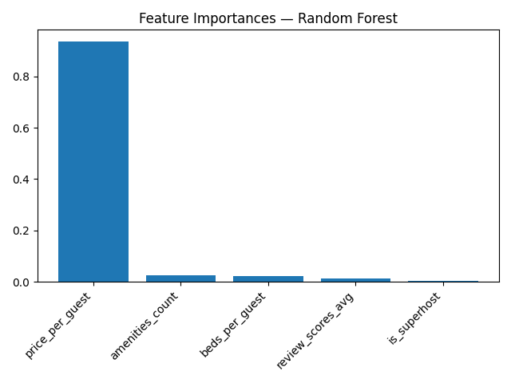

# Airbnb Austin — Pricing & Occupancy Insights

## Overview
How can Airbnb hosts in Austin optimize pricing and occupancy?  
This project analyzed 3,040 listings from [InsideAirbnb](http://insideairbnb.com/get-the-data.html) to predict nightly rates and uncover what factors drive them.  
By combining exploratory analysis with machine learning, the project provides actionable insights for hosts, investors, and platforms.

**Tools & Methods:** Python (Pandas, Scikit-learn), Jupyter, Random Forest Regression, Linear Regression, Feature Engineering, Data Visualization.

---

## 🔑 Key Insights
- **Price per guest** is the strongest driver of nightly rate — a simple, reliable lever for hosts.  
- **Neighborhood and seasonality** create meaningful price differences that can inform investment and marketing strategies.  
- **Amenities and reviews** play a secondary but notable role in pricing.  
- **Superhost status** has limited influence on price, suggesting reputation may matter more for occupancy than rates.  
- Random Forest achieved significantly better predictive accuracy than Linear Regression (MAE $87 vs $120, R² 0.71 vs 0.27).

👉 See the full writeup with **Executive Summary, Host Briefing, and Traveler Personas**:  
[`reports/ai_summaries.md`](reports/ai_summaries.md)

---

## 📊 Example Visuals
  
*Feature importance ranking (Random Forest model).*

Additional visuals:  
- Model accuracy comparisons  
- Residual diagnostics  
- Neighborhood-level price differences  

---

## 💡 Business Value
This project highlights the main levers Airbnb hosts can pull to optimize pricing, improve occupancy forecasts, and increase revenue. It also demonstrates how predictive modeling can inform platform strategy and traveler segmentation.

---

## 📁 Repo Structure
```text
data/
  RAW/           # (ignored) raw downloads
  PROCESSED/     # cleaned/engineered files (e.g., listings_features.csv)
figures/         # exported charts
models/          # serialized models (large .pkl files, optional in Git)
notebooks/
  01_eda.ipynb       # exploratory data analysis
  02_model_price.ipynb # feature engineering + ML models
reports/
  ai_summaries.md  # executive summary, host briefing, traveler personas
README.md          # this file
requirements.txt   # project dependencies

